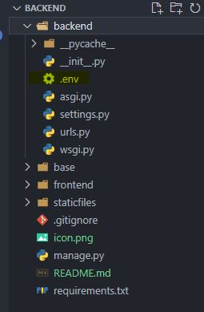

# Basketballworld APP

> The Process to implement the app in your local invironment

## 1// clone the project then tap the following commands

```bash
pip install virtualenvwrapper-win
mkvirtualenv projectBasket
pip install -r requirements.txt

```

## 2// put the .env file provided by the author of the project in : backend > .env (next to the setting.py)



> then run the project using the command:

```bash
python manage.py runserver

```

> The server ganna be running in port 8000 .Make sur it's not already used
